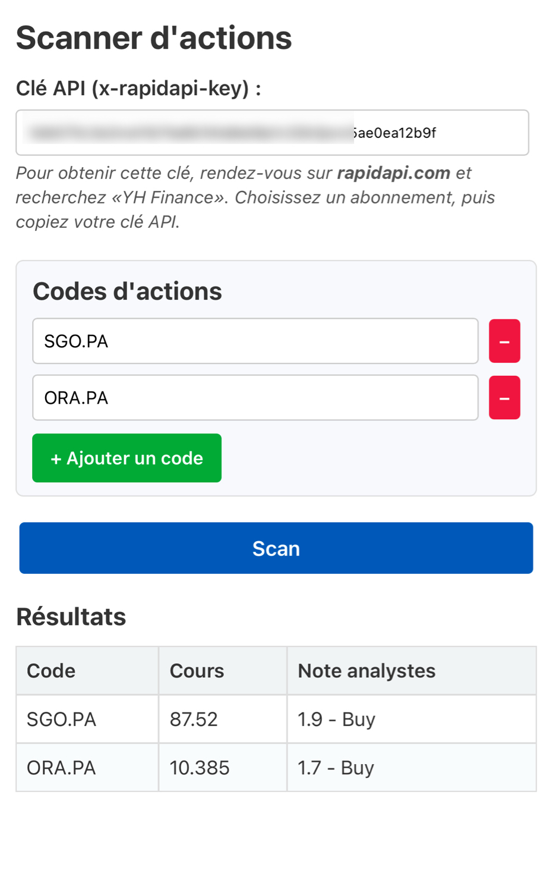

# Scanner d'actions (Yahoo Finance via RapidAPI)

Cette application est une page HTML autonome qui permet de :
- Gérer une **liste dynamique** de symboles d’actions (comme `SGO.PA`, `EPA:SGO`, etc.).
- Convertir automatiquement les formats `EPA:XXX` en `XXX.PA`, compatibles avec **Yahoo Finance**.
- Saisir une **clé API** de RapidAPI pour interroger le service Yahoo Finance.
- Afficher les **cours de bourse** et l’**évaluation moyenne** des analystes.
- **Sauvegarder** en local la clé et les codes pour un usage ultérieur.

---

## 1. Installation et utilisation

1. **Téléchargez** ou **copiez-collez** le fichier `index.html` dans un répertoire local.  
2. **Ouvrez** le fichier `index.html` avec un navigateur (Chrome, Firefox, Safari…).  
3. Dans l’interface, **saisissez** :
   - Votre clé API (voir la section [Obtenir votre clé API](#3-obtenir-votre-clé-api-sur-rapidapi) ci-dessous).
   - Les symboles des actions à suivre (par ex. `EPA:SGO` ou `SGO.PA`).
4. Cliquez sur **Scan** pour lancer la requête vers l’API Yahoo Finance.  
5. Les **résultats** apparaissent sous forme de tableau :  
   - Le **symbol** (le code d’actions utilisé par Yahoo).  
   - Le **cours** actuel (regularMarketPrice).  
   - La **note moyenne** des analystes (averageAnalystRating).

### 1.1 Conversion automatique (EPA:XXX → XXX.PA)
Si vous saisissez un symbole en format `EPA:SGO`, l’application le convertira automatiquement en `SGO.PA` pour que Yahoo Finance puisse l’identifier correctement.  

---

## 2. Sauvegarde des données
L’appli utilise le **Local Storage** du navigateur :
- La **clé API** que vous saisissez est stockée localement.  
- Les **codes** d’actions ajoutés sont également mémorisés.  

Ainsi, lorsque vous réouvrez l’application, vous retrouvez votre clé et votre liste d’actions sans avoir à tout ressaisir.

---

## 3. Obtenir votre clé API sur RapidAPI

1. Rendez-vous sur [RapidAPI.com](https://rapidapi.com/).  
2. Créez un compte (gratuit) ou connectez-vous si vous en avez déjà un.  
3. Cherchez **Yahoo Finance** dans le catalogue d’API, par exemple en tapant « Yahoo Finance ».  
4. Sélectionnez un **abonnement** (gratuit ou payant, selon vos besoins).  
5. Rendez-vous ensuite dans la **section « Endpoints »** (ou « API Key » / « Security » selon la présentation du site).  
6. **Copiez** votre **x-rapidapi-key**.  
7. **Collez** cette clé dans le champ « Clé API (x-rapidapi-key) » de l’application.  

*(Note : Vous pouvez configurer le `x-rapidapi-host` et d’autres paramètres si l’API l’exige, mais le code fourni s’en charge déjà avec la valeur `'yahoo-finance15.p.rapidapi.com'`.)*

---

## 4. Mise en place en tant que WebApp sur iPhone

L’application est un simple fichier HTML + JavaScript + CSS intégré. Pour l’utiliser en « mode application » sur iOS (iPhone/iPad) :

1. **Hébergez** le fichier `index.html` quelque part (par exemple sur un petit serveur, ou en local sur votre machine si vous utilisez un outil type `http-server`). Vous pouvez aussi l’ouvrir directement depuis un lien local.
2. **Ouvrez** l’URL de votre page `index.html` dans **Safari** sur iOS.
3. Touchez l’icône **Partager** (carré avec une flèche vers le haut).
4. Dans les options, sélectionnez **« Sur l’écran d’accueil »**.
5. **Nommez** l’application (ex. « Scan Actions ») puis validez.  
6. Vous aurez alors une **icône** sur l’écran d’accueil de votre iPhone ou iPad, comme une app native.  
7. **Lancez** l’appli depuis cette icône : vous arrivez sur l’interface qui vous propose de saisir la clé et les codes d’actions.

### 4.1 Avantages du mode « Écran d’accueil »
- L’interface s’ouvre sans l’UI standard de Safari (en plein écran).  
- Vous pouvez balayer vers le haut pour fermer, comme une app normale.  
- Les données (clé, codes) restent stockées localement grâce au Local Storage même si vous quittez l’application.

---

## 5. Problèmes courants et solutions

- **« Clé API invalide »** ou **« Erreur HTTP 401 »** : vérifiez que vous avez bien saisi votre `x-rapidapi-key` et que votre abonnement RapidAPI est actif.  
- **« Rien ne s’affiche »** : ouvrez la console du navigateur (F12 sur PC, ou Inspecter sur Chrome) pour voir s’il y a un message d’erreur.  
- **Symboles introuvables** : vérifiez le format. Par exemple, l’action Arkema s’écrit `AKE.PA` sur Yahoo Finance, tandis que Google Finance l’affiche sous `EPA:AKE`.

---

## 6. Personnalisation

Vous pouvez modifier le code pour :
- Ajouter d’autres conversions (par ex. `EPA:xxx` → `xxx.PA`, `BIT:xxx` → `xxx.MI` pour la Bourse italienne, etc.).  
- Changer le style CSS à votre goût.  
- Adapter les **données affichées** (par ex. Volume, MarketCap, etc.).

N’hésitez pas à forker ce projet ou à le copier pour en faire votre propre scanner d’actions sur-mesure !

---

## 7. Licence

Vous pouvez utiliser, adapter et partager ce code librement (MIT ou équivalent).  
Aucune garantie n’est fournie quant à l’exactitude ou à la disponibilité des données boursières. Utilisation à vos risques et périls.

